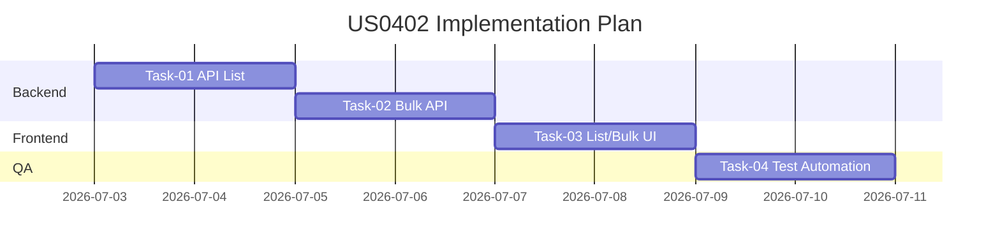

# PLAN-US0402 - Execution Plan

Related Story: https://github.com/sa-kannguyen/test-harness-workflow/issues/13
Related PRD: https://github.com/sa-kannguyen/test-harness-workflow/issues/14
Related TDD: https://github.com/sa-kannguyen/test-harness-workflow/issues/15

## 1) Delivery Sequence

## 2) Task Links
1. TASK-US0402-01: https://github.com/sa-kannguyen/test-harness-workflow/issues/16
2. TASK-US0402-02: https://github.com/sa-kannguyen/test-harness-workflow/issues/17
3. TASK-US0402-03: https://github.com/sa-kannguyen/test-harness-workflow/issues/18
4. TASK-US0402-04: https://github.com/sa-kannguyen/test-harness-workflow/issues/19

## 3) Risk Watch
- Legacy parity ambiguity around status transition exceptions
- External DOMONET coupling and retry behavior
- Permission rule drift in migration
