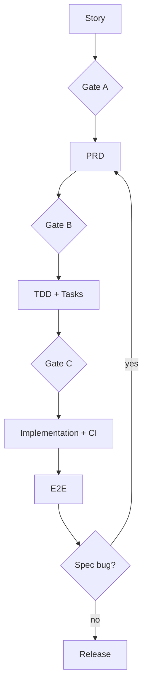

# PLAN-US0501

Related Story: https://github.com/sa-kannguyen/test-harness-workflow/issues/23
Related PRD: https://github.com/sa-kannguyen/test-harness-workflow/issues/24
Related TDD: https://github.com/sa-kannguyen/test-harness-workflow/issues/25

## Delivery Sequence
1. https://github.com/sa-kannguyen/test-harness-workflow/issues/26
2. https://github.com/sa-kannguyen/test-harness-workflow/issues/27
3. https://github.com/sa-kannguyen/test-harness-workflow/issues/28
4. https://github.com/sa-kannguyen/test-harness-workflow/issues/29

## Governance Flow

