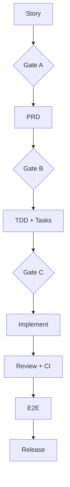

# PLAN-US0502 (VI)

Related: Story https://github.com/sa-kannguyen/test-harness-workflow/issues/33 | PRD https://github.com/sa-kannguyen/test-harness-workflow/issues/34 | TDD https://github.com/sa-kannguyen/test-harness-workflow/issues/35

## Execution order
1. TASK-01 (auth + filter parser)
2. TASK-02 (ajax json contract)
3. TASK-03 (csv flows)
4. TASK-04 (automation + CI)

## Governance

