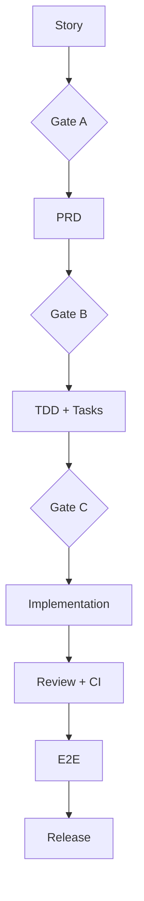

# PLAN-US0502

Related Story: https://github.com/sa-kannguyen/test-harness-workflow/issues/33
Related PRD: https://github.com/sa-kannguyen/test-harness-workflow/issues/34
Related TDD: https://github.com/sa-kannguyen/test-harness-workflow/issues/35

## Task Sequence
1. https://github.com/sa-kannguyen/test-harness-workflow/issues/36
2. https://github.com/sa-kannguyen/test-harness-workflow/issues/37
3. https://github.com/sa-kannguyen/test-harness-workflow/issues/38
4. https://github.com/sa-kannguyen/test-harness-workflow/issues/39

## Governance

