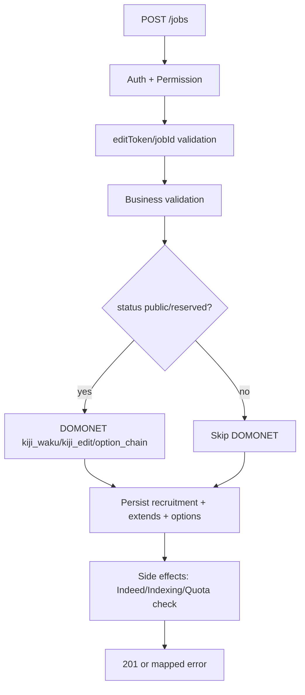

# PRD-US0501

Related Story: https://github.com/sa-kannguyen/test-harness-workflow/issues/23

## Architecture

## API Contract
- Endpoint: `POST /jobs`
- Content-Type: `application/json` or `multipart/form-data`
- Auth: CMS session (Bearer/Cookie)
- Permission: recruitment management (`isauth=true`)

### Success (201)
- `jobId`, `status`, `adId`, `editToken`, `publicationQuota`, `sideEffects`

### Error map
- 401 `UNAUTHORIZED`
- 403 `FORBIDDEN`
- 422 `VALIDATION_ERROR`
- 409 `PUBLICATION_LIMIT_EXCEEDED`
- 502 `DOMONET_API_ERROR`

## Data Design (draft)
- `recruitment` insert on create
- `recruitment_extend` append history row
- `dtb_dn_option` write option chains
- `data_dtb_indeedapi` enqueue on publish-related conditions

## Non-functional
- Contract-first response schema stability
- Idempotency safeguard against duplicate submit tokens (future enhancement)
- Trace logging for external API failures
