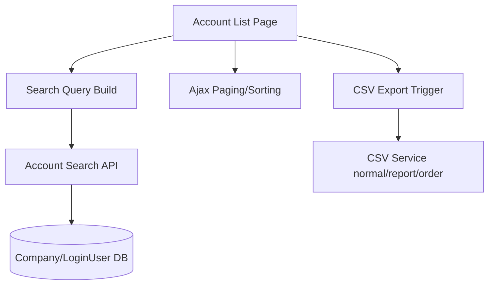

# PRD-US0502

Related Story: https://github.com/sa-kannguyen/test-harness-workflow/issues/33

## Architecture Flow

## Backend Design
- Endpoint 1: `GET /at-manage/accounts` (initial render or API mode)
- Endpoint 2: `POST /at-manage/accounts/search` (`output_type=json`) for ajax list updates
- Endpoint 3: `POST /at-manage/accounts/export` (`csv_type: normal|_report|_order`)
- Endpoint 4: `GET /at-manage/getbusho` for department-member linkage

## Auth/Permission
- Require `atid > 0`
- Require account-search permission (function id 2)
- Unauthorized redirect/403 behavior by endpoint type

## Frontend Design
- Components:
  - `AccountSearchForm`
  - `AccountTable`
  - `PagerControl`
  - `CsvActionPanel`
- Preserve `searchkey` behavior for ajax paging/sort

## Data/Rule Notes
- Keep status='指定なし(3)' logic as no-status-filter
- Keep sub-account inclusion toggle (`sub=1`)
- Keep manager-only page size option (all records)
