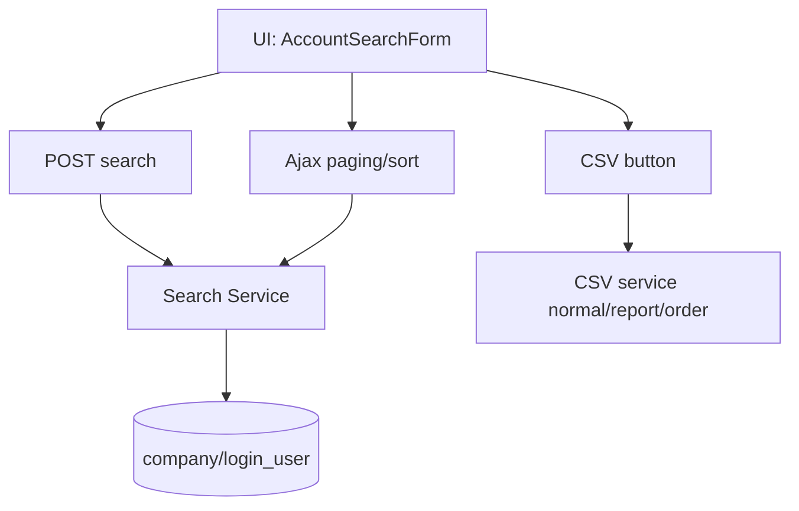

# PRD-US0502 (VI) - Account Search/List Replace

Related Story: https://github.com/sa-kannguyen/test-harness-workflow/issues/33

## 1) Kiến trúc xử lý


## 2) Backend contracts (để DEV code thẳng)

### 2.1 POST `/at-manage/account.php` (search full page)
**Input chính:** `kensaku=1`, filter fields (`date_from`, `date_to`, `status`, `plan`, `kind[]`, `accountName`, ...)
**Output:** HTML full page + list rows.

### 2.2 POST `/at-manage/account.php` (ajax)
**Input:** `output_type=json`, `p,c,s,d,searchkey`
**Output JSON:**
```json
{
  "result": true,
  "html": "<tr>...</tr>",
  "allcount": 123,
  "pngerrmsg": ""
}
```

### 2.3 POST `/at-manage/account.php` (csv)
**Input:** `output_type=csv`, `csv_type` (`""|"_report"|"_order"`), filter hidden, sort params.
**Output:** file download Shift_JIS + cookie `downloaded`.

### 2.4 GET `/at-manage/getbusho.php`
**Input:** `busho`, `token`
**Output:** member list JSON (403 nếu token sai/chưa login).

## 3) Mapping rule quan trọng
- `status=3` (指定なし) => không add điều kiện status vào SQL.
- `sub` unchecked => chỉ `is_superuser=1`.
- Form chỉnh tay nhưng chưa bấm search: ajax vẫn dùng `searchkey` cũ.

## 4) NFR
- Ajax list update < 1s với page size 20 trong dữ liệu thường.
- CSV không double-submit (button disable + restore theo cookie).
