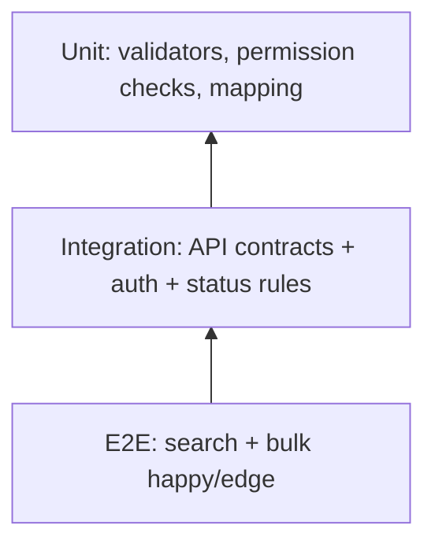

# TDD-US0402 - Test Design Document

Related PRD: https://github.com/sa-kannguyen/test-harness-workflow/issues/14

## 1) Test Pyramid

## 2) Coverage Matrix
| Area | Case ID | Scenario | Expected |
|---|---|---|---|
| Auth | AUTH-01 | API call without session | 401 JSON |
| Permission | AUTH-02 | Session without recruitment permission | 403 JSON |
| Search | SRCH-01 | keyword + status filter | matching rows |
| Paging | SRCH-02 | page/size boundary | stable allCount + page rows |
| Variant | SRCH-03 | `kind=error` | disallowed actions hidden |
| Bulk | BULK-01 | valid `public_all` | success increments |
| Bulk | BULK-02 | lock conflict | errorcode 970/980 |
| Bulk | BULK-03 | csrf mismatch | errorcode 990 |
| CSV | CSV-01 | export with active filters | output matches filter |

## 3) Mandatory Automation
- API integration: AUTH-01/02, SRCH-01/02, BULK-01/02/03
- E2E smoke: search flow + bulk flow + summary rendering

## 4) Exit Criteria
- All P1 test cases pass
- No critical regression on legacy parity checkpoints
- CI green for API + E2E smoke suite

## 5) Defect Triage Loop
When test fails, classify defect root first:
1. **Code defect** → fix in implementation task, keep spec unchanged.
2. **Spec/design defect** → update PRD/TDD/Task and then implement.
3. **Test defect** → fix flaky/incorrect test script and rerun.
