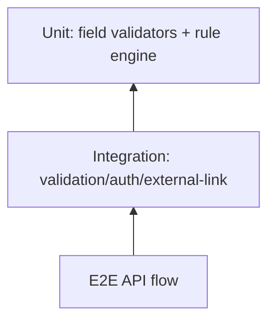

# TDD-US0501

Related PRD: https://github.com/sa-kannguyen/test-harness-workflow/issues/24

## Test Pyramid

## Mandatory Cases
- AUTH-01: no session -> 401
- AUTH-02: no permission -> 403
- VAL-01: invalid editToken -> 422
- VAL-02: `jobId > 0` on create -> 422
- PUB-01: public status + DOMONET success -> 201 with `adId`
- PUB-02: public status + DOMONET failure -> 502 and no DB commit
- DRAFT-01: draft save skips DOMONET
- QUOTA-01: post-save quota overrun -> 409 rollback behavior

## Exit Criteria
- P1 cases automated and passing in CI
- Error code mapping snapshot locked
