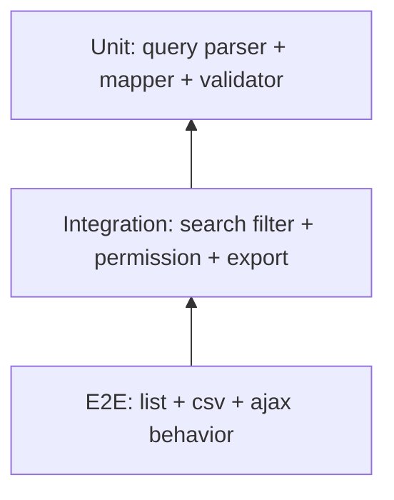

# TDD-US0502

Related PRD: https://github.com/sa-kannguyen/test-harness-workflow/issues/34

## Test Pyramid

## Mandatory Cases
- AUTH-01: unauthenticated -> redirect/login behavior
- AUTH-02: no permission -> menu redirect/forbidden behavior
- SRCH-01: multi-condition filter returns expected rows
- SRCH-02: paging + sort with `searchkey` consistency
- CSV-01: normal CSV export success
- CSV-02: report CSV export success
- CSV-03: order CSV export gated by environment flag
- AJAX-01: ajax failure shows "検索結果エラー"

## Exit Criteria
- P1 cases automated or scriptable and pass
- CSV download behavior verified with cookie/download restore flow
